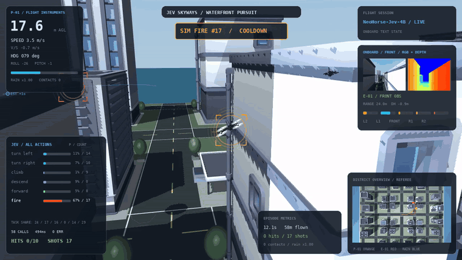
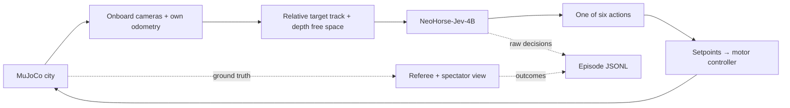

<p align="center">
  
</p>

<p align="center">
  <a href="LICENSE"></a>
  <a href="docs/quickstart.md"></a>
  <a href="https://huggingface.co/TokenRhythm/NeoHorse-Jev-4B"></a>
</p>

<p align="center">
  <b>English</b> · <a href="README.zh-CN.md">简体中文</a><br>
  <a href="#quick-start">Quick start</a> · <a href="docs/architecture.md">Architecture</a> · <a href="docs/policy.md">Prompt &amp; actions</a> · <a href="docs/data.md">Data collection</a>
</p>

# Multi-UAV JEV

A research platform for camera-based UAV pursuit in a textured MuJoCo city. Watch a Jev decision model select flight actions, inspect every candidate probability, and collect successful and failed episodes for future training.

**This release is a one-pursuer / one-evader baseline.** Multi-UAV coordination is planned; the current simulator does not yet implement a cooperative fleet.



*A five-second excerpt from a real simulation replay, looped. RGB/depth panels, attitude instruments, action statistics and the overview remain visible. [Still image](assets/readme/simulation.jpg).*

## What you can explore

- **An open urban airspace.** Twelve CC0 building meshes form a waterfront district with roads, varied roofs and a moving rain patch.
- **Decisions from onboard observations.** Relative target direction, range, altitude difference, track history, short forecasts and depth-derived free space feed Jev as structured text.
- **Six explicit actions.** Left, right, climb, descend, forward and simulated fire. The controller translates the selected action into setpoints and motor thrust.
- **A live flight cockpit.** Heading-following camera, mouse drag/zoom, RGB/depth views, colored probabilities, counts for all actions, a north-up overview and a restart button.
- **Inspectable episodes.** Every model response and its execution status are logged. Completed episodes are archived as JSON/JSONL; the best qualifying replay is retained.

## How it works



**Observation boundary:** RGB is displayed; depth and an ideal MuJoCo segmentation detector produce the structured observations. Jev receives **text**, not raw RGB/depth tensors. Enemy truth coordinates, building coordinates and the evader's scripted future route are excluded from the decision input. The referee and spectator view can use simulation truth. See [the architecture](docs/architecture.md).

## Quick start

The validated runtime is **Linux, Python 3.12, MuJoCo 3.14.0**, with an EGL renderer and a separately running NeoHorse decision endpoint. Model weights and GPU inference dependencies are downloaded separately.

```bash
git clone https://github.com/YongLD/Multi-UAV-JEV.git
cd Multi-UAV-JEV
bash setup.sh
```

Start the model in another terminal using [the model setup guide](docs/model-setup.md). If you already have a compatible local service:

```bash
export JEV_ENDPOINT=http://127.0.0.1:8000/v1/systemone
bash run.sh
```

Open **[http://127.0.0.1:8080](http://127.0.0.1:8080)**. The runner repeats episodes with new seeds and archives their text records. Press `Ctrl+C` to stop the runner and its viewer. No rule-based tactical fallback is used when the model service fails.

<details>
<summary><b>Run options</b></summary>

```bash
# Run one episode; the viewer stops when it ends.
bash run.sh --once --seconds 120 --seed 42

# Collect cases without a browser server.
bash run.sh --no-viewer

# Omit candidate selection conditions; keep mission and action meanings.
DUEL_POLICY_MODE=free bash run.sh

# Choose a viewer port and a data directory.
VIEW_PORT=8090 DATA_DIR=./runs-experiment bash run.sh
```

Copy `.env.example` to `.env` for persistent local settings. For rendering, model installation, SSH forwarding and troubleshooting, see [the complete quick start](docs/quickstart.md).

</details>

## Action contract

| Model choice | Controller effect |
| --- | --- |
| `turn_left` | Set target heading to execution-time heading +45°. |
| `turn_right` | Set target heading to execution-time heading −45°. |
| `climb` | Set altitude to execution-time altitude +2 m (ceiling 36 m). |
| `descend` | Set altitude to execution-time altitude −2 m (floor 3 m). |
| `forward` | Set heading and altitude to the current pose; cancel earlier turn/climb targets. |
| `fire` | Attempt one virtual shot; preserve the existing flight setpoints. |

Speed and braking are controller-owned. The pursuer's speed setpoint ceiling is **6.3 m/s**; the evader independently cruises at **4.6–5.2 m/s** before rain reduction. This controller is not an unconstrained executor: it enforces physical setpoints, altitude bounds and depth-based speed limits, without substituting another tactical action. Responses older than 1.2 simulation seconds are recorded and discarded. [Exact prompt and execution semantics →](docs/policy.md)

## Outcomes, replay and data

A valid virtual hit requires **range ≤25 m**, **horizontal bearing ≤40°**, **altitude difference ≤1 m** and a **2 s cooldown**. Ten hits complete an episode. Timeouts, crashes and manual restarts are also recorded.

The replay is updated only when the finished episode has **at least five hits** and **at least as many hits as the retained replay**; ties are accepted. Data collection archives completed episodes independently of replay eligibility.

```text
runs/
├── live/                     # Frames, status and the retained replay
└── cases/<timestamp>_seedN/
    ├── decisions.jsonl       # State, choice, probabilities, latency, applied status
    ├── events.jsonl          # Virtual shots and collisions
    ├── referee.jsonl         # Evaluation truth, separate from decision inputs
    ├── policy.json           # Actual prompt, candidates and action semantics
    └── summary.json          # Outcome, hits, counts and model errors
```

These are **raw training candidates**, not expert labels. The model's own selected actions must not automatically be treated as correct demonstrations. Curate labels and split by episode before fine-tuning. [Data schema and collection notes →](docs/data.md)

## Project layout

```text
sim/                  MuJoCo scene, camera perception, Jev client, controller and UI
sim/urban_assets/     Small CC0 city meshes, palette and source/license records
scripts/run.py        Process ownership and continuous episode collection
docs/                 Setup, observation boundary, policy and data documentation
assets/readme/        Editable SVG identity, real replay GIF and a still image
setup.sh              Simulation environment + pinned Skydio X2 asset checkout
run.sh                Start the viewer and simulation loop
run_model.sh          Start an installed native NeoHorse decision runtime
```

## Current limits and next steps

Tracking and obstacle avoidance are experimental. Finite camera coverage, occlusion, prediction errors, model latency and conservative mesh collision hulls can still cause lost tracks or contacts. A normalized action distribution does not guarantee a correct maneuver or real-time operation. The evader is a scenario-controlled kinematic actor; only the pursuer uses the quadrotor motor controller.

Planned work includes cooperative multi-UAV observation and assignment, replacing ideal segmentation with a visual detector, stronger temporal depth mapping, and low-altitude decision fine-tuning with independently evaluated labels. These capabilities are not part of this release.

## Acknowledgements and license

The simulation builds on [RomanSlack/jev-drone](https://github.com/RomanSlack/jev-drone) and the [MuJoCo Menagerie Skydio X2 model](https://github.com/google-deepmind/mujoco_menagerie/tree/main/skydio_x2). City meshes are from [Kenney City Kit Commercial](https://kenney.nl/assets/city-kit-commercial). Decisions use the external [TokenRhythm NeoHorse-Jev-4B release](https://huggingface.co/TokenRhythm/NeoHorse-Jev-4B).

New project contributions are **Apache-2.0**. Inherited jev-drone code retains **MIT** terms; bundled city assets are **CC0**. Downloaded robot assets, model weights and inference runtimes retain their own licenses. See [LICENSE](LICENSE), [NOTICE](NOTICE) and [the original MIT license](licenses/jev-drone-MIT.txt).
