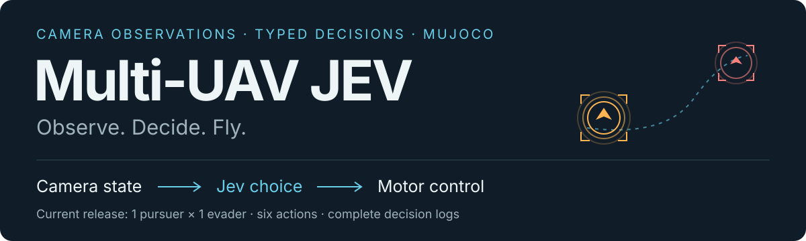
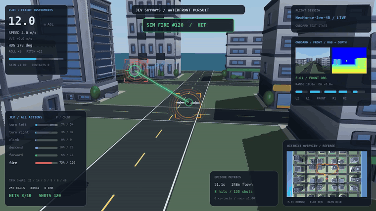

<p align="center">
  
</p>

<p align="center">
  <a href="README.md">English</a> · <b>简体中文</b><br>
  <a href="#快速开始">快速开始</a> · <a href="docs/architecture.md">架构</a> · <a href="docs/policy.md">Prompt 与动作</a> · <a href="docs/data.md">数据采集</a>
</p>

# Multi-UAV JEV

面向低空无人机决策研究的城市追逐仿真平台：让 Jev 根据机载观测选择飞行动作，在浏览器中查看追逐过程、完整动作概率与统计，并持续收集成功和失败案例。

**当前开源版本是一架追逐机对一架逃逸机的基线。** 项目面向后续多无人机协同拓展，现阶段尚未实现协同机群。

<p align="center">
  
</p>

<p align="center"><em>选取真实回放中航向平稳、连续有效命中的片段：绿色 HIT 提示和射线特效展示成功发射，保留 RGB/深度图、仪表、动作统计和俯视图。此片段不代表整体成功率。</em></p>

## 能做什么

- **城市开放空域：** 12 种 CC0 建筑模型拼成滨水城市，包含道路、不同楼高和移动雨区。
- **机载观测决策：** 输入目标相对方位、高度差、距离趋势、观测轨迹、短期预测、深度可飞空间及本机状态。
- **六种离散动作：** 左转、右转、上升、下降、直行、模拟发射；控制器负责将动作转成姿态与电机指令。
- **实时仪表与回放：** 跟随本机航向的镜头、鼠标偏转和缩放、RGB/DEPTH、彩色概率条、全部动作计数、右下角俯视图、重启本局。
- **持续采集：** 完整记录状态、模型选择、概率、时延、是否执行和任务结果，成功与失败均归档。

## 框架逻辑

```text
机载深度 / 分割观测 + 本机里程计
             ↓
相对目标跟踪 + 轨迹外推 + 局部可飞空间
             ↓
NeoHorse-Jev-4B：结构化文本 → 六选一动作和完整概率
             ↓
动作 → 飞行设定值 → 电机控制 → MuJoCo 物理仿真
```

**模型输入边界：** RGB 用于显示；深度与 MuJoCo 理想分割器提取结构化观测。本版给 Jev 的是文本 JSON，尚未把 RGB/DEPTH 图像张量直接交给模型。敌机真值坐标、建筑坐标和敌机预设未来航线不进入 Jev；裁判与旁观镜头可以使用仿真真值。完整说明见 [架构文档](docs/architecture.md)。

## 快速开始

已验证环境为 **Linux + Python 3.12 + MuJoCo 3.14.0 + EGL**。仿真与模型服务分开安装；模型权重需要另外下载。

```bash
git clone https://github.com/YongLD/Multi-UAV-JEV.git
cd Multi-UAV-JEV
bash setup.sh
```

按 [模型安装文档](docs/model-setup.md) 在另一终端启动 NeoHorse 服务。已有服务时直接运行：

```bash
export JEV_ENDPOINT=http://127.0.0.1:8000/v1/systemone
bash run.sh
```

本机浏览器打开 **[http://127.0.0.1:8080](http://127.0.0.1:8080)**。默认持续运行，每局结束归档并使用新种子开始下一局；`Ctrl+C` 停止仿真和页面服务。端口转发与配置见 [快速开始](docs/quickstart.md)。

```bash
# 单局运行，结束后也停止页面服务
bash run.sh --once --seconds 120 --seed 42

# 不给每个候选动作提供选择条件；仍保留目标、规则与动作含义
DUEL_POLICY_MODE=free bash run.sh

# 仅后台采集
bash run.sh --no-viewer
```

## 动作与命中规则

| 动作 | 执行含义 |
| --- | --- |
| `turn_left` / `turn_right` | 以动作执行时的本机航向为基准，将目标航向左转 / 右转 45°。 |
| `climb` / `descend` | 以执行时高度为基准上升 / 下降 2 m，设定值边界为 3–36 m。 |
| `forward` | 锁定当前航向与高度，取消前一次尚未完成的转向或升降目标。 |
| `fire` | 尝试一次虚拟发射，保留飞行设定值。 |

速度与制动由控制器管理：追逐机速度设定值上限 6.3 m/s，逃逸机独立巡航速度 4.6–5.2 m/s；雨区降速。控制器包含高度边界与深度制动约束，不会重选另一战术动作。超过 1.2 仿真秒的模型响应记录后丢弃。完整 Prompt 由 [策略代码](sim/duel_tactics.py) 生成，每局保存到 `policy.json`；解释见 [策略文档](docs/policy.md)。

有效命中要求：距离 ≤25 m、水平偏角 ≤40°、高度差 ≤1 m，冷却时间 2 s。**10 次有效命中算成功。** 回放只保留命中 **≥5 次** 且命中数 **≥已有回放** 的对局，相同命中数也可以更新。

## 数据和后续训练

每局保留 `decisions.jsonl`、`events.jsonl`、`referee.jsonl`、`policy.json` 和 `summary.json`，位于 `runs/cases/`。模型的原始输入与选择、所有动作概率、响应时延、实际执行标记和最终结果都有记录；回放是否入选不影响文本采集。

这些数据是待筛选素材，**不是已验证的专家标签**。不能把模型自己选出的动作直接当成正确答案训练。微调前需要人工或独立评测产生标签，并按整局划分训练集和测试集。[数据说明 →](docs/data.md)

## 当前限制

本版仍属于实验基线，可能因有限视野、遮挡、预测误差、推理时延和建筑碰撞近似而丢失目标或发生接触。逃逸机由场景控制器做运动学驱动；追逐机才执行电机控制。尚未完成真实视觉检测、多机协同和低空专用训练，不能将当前效果视为可靠实机避障能力。

## 来源与许可

基于 [RomanSlack/jev-drone](https://github.com/RomanSlack/jev-drone) 拓展，使用 [MuJoCo Menagerie Skydio X2](https://github.com/google-deepmind/mujoco_menagerie/tree/main/skydio_x2)、[Kenney 城市素材](https://kenney.nl/assets/city-kit-commercial) 和外部 [NeoHorse-Jev-4B](https://huggingface.co/TokenRhythm/NeoHorse-Jev-4B) 模型。

新增项目代码采用 **Apache-2.0**；继承的上游代码保留 **MIT** 许可；内置城市素材为 **CC0**。模型与下载的机器人素材沿用各自许可。详见 [LICENSE](LICENSE)、[NOTICE](NOTICE) 和 [上游 MIT 原文](licenses/jev-drone-MIT.txt)。
